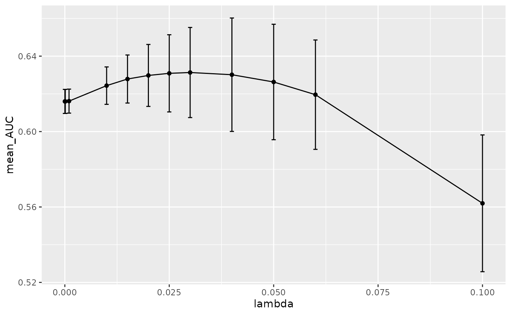

# Hyperparameter tuning

One particularly important aspect of machine learning (ML) is
hyperparameter tuning. A hyperparameter is a parameter that is set
before the ML training begins. These parameters are tunable and they
effect how well the model trains. We must do a grid search for many
hyperparameter possibilities and exhaust our search to pick the ideal
value for the model and dataset. In this package, we do this during the
cross-validation step.

Let’s start with an example ML run. The input data to
[`run_ml()`](http://www.schlosslab.org/mikropml/dev/reference/run_ml.md)
is a dataframe where each row is a sample or observation. One column
(assumed to be the first) is the outcome of interest, and all of the
other columns are the features. We package `otu_mini_bin` as a small
example dataset with `mikropml`.

``` r

# install.packages("devtools")
# devtools::install_github("SchlossLab/mikropml")
library(mikropml)
head(otu_mini_bin)
#>       dx Otu00001 Otu00002 Otu00003 Otu00004 Otu00005 Otu00006 Otu00007
#> 1 normal      350      268      213        1      208      230       70
#> 2 normal      568     1320       13      293      671      103       48
#> 3 normal      151      756      802      556      145      271       57
#> 4 normal      299       30     1018        0       25       99       75
#> 5 normal     1409      174        0        3        2     1136      296
#> 6 normal      167      712      213        4      332      534      139
#>   Otu00008 Otu00009 Otu00010
#> 1      230      235       64
#> 2      204      119      115
#> 3      176       37      710
#> 4       78      255      197
#> 5        1      537      533
#> 6      251      155      122
```

Before we train and evaluate a ML model, we can preprocess the data. You
can learn more about this in the preprocessing vignette:
[`vignette("preprocess")`](http://www.schlosslab.org/mikropml/dev/articles/preprocess.md).

``` r

preproc <- preprocess_data(
  dataset = otu_mini_bin,
  outcome_colname = "dx"
)
#> Using 'dx' as the outcome column.
dat <- preproc$dat_transformed
```

We’ll use `dat` for the following examples.

## The simplest way to `run_ml()`

As mentioned above, the minimal input is your dataset (`dataset`) and
the machine learning model you want to use (`method`).

When we
[`run_ml()`](http://www.schlosslab.org/mikropml/dev/reference/run_ml.md),
by default we do a 100 times repeated, 5-fold cross-validation, where we
evaluate the hyperparameters in these 500 total iterations.

Say we want to run L2 regularized logistic regression. We do this with:

``` r

results <- run_ml(dat,
  "glmnet",
  outcome_colname = "dx",
  cv_times = 100,
  seed = 2019
)
#> Using 'dx' as the outcome column.
#> Training the model...
#> Loading required package: ggplot2
#> Loading required package: lattice
#> 
#> Attaching package: 'caret'
#> The following object is masked from 'package:future':
#> 
#>     cluster
#> The following object is masked from 'package:mikropml':
#> 
#>     compare_models
#> Training complete.
```

You’ll probably get a warning when you run this because the dataset is
very small. If you want to learn more about that, check out the
introductory vignette about training and evaluating a ML model:
[`vignette("introduction")`](http://www.schlosslab.org/mikropml/dev/articles/introduction.md).

By default,
[`run_ml()`](http://www.schlosslab.org/mikropml/dev/reference/run_ml.md)
selects hyperparameters depending on the dataset and method used.

``` r

results$trained_model
#> glmnet 
#> 
#> 161 samples
#>  10 predictor
#>   2 classes: 'cancer', 'normal' 
#> 
#> No pre-processing
#> Resampling: Cross-Validated (5 fold, repeated 100 times) 
#> Summary of sample sizes: 128, 129, 129, 129, 129, 130, ... 
#> Resampling results across tuning parameters:
#> 
#>   lambda  logLoss    AUC        prAUC      Accuracy   Kappa       F1       
#>   1e-04   0.7113272  0.6123301  0.5725828  0.5853927  0.17080523  0.5730989
#>   1e-03   0.7113272  0.6123301  0.5725828  0.5853927  0.17080523  0.5730989
#>   1e-02   0.7112738  0.6123883  0.5726478  0.5854514  0.17092470  0.5731635
#>   1e-01   0.6819806  0.6210744  0.5793961  0.5918756  0.18369829  0.5779616
#>   1e+00   0.6803749  0.6278273  0.5827655  0.5896356  0.17756961  0.5408139
#>   1e+01   0.6909820  0.6271894  0.5814202  0.5218000  0.02920942  0.1875293
#>   Sensitivity  Specificity  Pos_Pred_Value  Neg_Pred_Value  Precision
#>   0.5789667    0.5920074    0.5796685       0.5977166       0.5796685
#>   0.5789667    0.5920074    0.5796685       0.5977166       0.5796685
#>   0.5789667    0.5921250    0.5797769       0.5977182       0.5797769
#>   0.5805917    0.6032353    0.5880165       0.6026963       0.5880165
#>   0.5057833    0.6715588    0.6005149       0.5887829       0.6005149
#>   0.0607250    0.9678676    0.7265246       0.5171323       0.7265246
#>   Recall     Detection_Rate  Balanced_Accuracy
#>   0.5789667  0.2839655       0.5854870        
#>   0.5789667  0.2839655       0.5854870        
#>   0.5789667  0.2839636       0.5855458        
#>   0.5805917  0.2847195       0.5919135        
#>   0.5057833  0.2478291       0.5886711        
#>   0.0607250  0.0292613       0.5142963        
#> 
#> Tuning parameter 'alpha' was held constant at a value of 0
#> AUC was used to select the optimal model using the largest value.
#> The final values used for the model were alpha = 0 and lambda = 1.
```

As you can see, the `alpha` hyperparameter is set to 0, which specifies
L2 regularization. `glmnet` gives us the option to run both L1 and L2
regularization. If we change `alpha` to 1, we would run L1-regularized
logistic regression. You can also tune `alpha` by specifying a variety
of values between 0 and 1. When you use a value that is between 0 and 1,
you are running elastic net. The default hyperparameter `lambda` which
adjusts the L2 regularization penalty is a range of values between 10^-4
to 10.

When we look at the 100 repeated cross-validation performance metrics
such as `AUC`, `Accuracy`, `prAUC` for each tested `lambda` value, we
see that some are not appropriate for this dataset and some do better
than others.

``` r

results$trained_model$results
#>   alpha lambda   logLoss       AUC     prAUC  Accuracy      Kappa        F1
#> 1     0  1e-04 0.7113272 0.6123301 0.5725828 0.5853927 0.17080523 0.5730989
#> 2     0  1e-03 0.7113272 0.6123301 0.5725828 0.5853927 0.17080523 0.5730989
#> 3     0  1e-02 0.7112738 0.6123883 0.5726478 0.5854514 0.17092470 0.5731635
#> 4     0  1e-01 0.6819806 0.6210744 0.5793961 0.5918756 0.18369829 0.5779616
#> 5     0  1e+00 0.6803749 0.6278273 0.5827655 0.5896356 0.17756961 0.5408139
#> 6     0  1e+01 0.6909820 0.6271894 0.5814202 0.5218000 0.02920942 0.1875293
#>   Sensitivity Specificity Pos_Pred_Value Neg_Pred_Value Precision    Recall
#> 1   0.5789667   0.5920074      0.5796685      0.5977166 0.5796685 0.5789667
#> 2   0.5789667   0.5920074      0.5796685      0.5977166 0.5796685 0.5789667
#> 3   0.5789667   0.5921250      0.5797769      0.5977182 0.5797769 0.5789667
#> 4   0.5805917   0.6032353      0.5880165      0.6026963 0.5880165 0.5805917
#> 5   0.5057833   0.6715588      0.6005149      0.5887829 0.6005149 0.5057833
#> 6   0.0607250   0.9678676      0.7265246      0.5171323 0.7265246 0.0607250
#>   Detection_Rate Balanced_Accuracy   logLossSD      AUCSD    prAUCSD AccuracySD
#> 1      0.2839655         0.5854870 0.085315967 0.09115229 0.07296554 0.07628572
#> 2      0.2839655         0.5854870 0.085315967 0.09115229 0.07296554 0.07628572
#> 3      0.2839636         0.5855458 0.085276565 0.09122242 0.07301412 0.07637123
#> 4      0.2847195         0.5919135 0.048120032 0.09025695 0.07329214 0.07747312
#> 5      0.2478291         0.5886711 0.012189172 0.09111917 0.07505095 0.07771171
#> 6      0.0292613         0.5142963 0.001610008 0.09266875 0.07640896 0.03421597
#>      KappaSD       F1SD SensitivitySD SpecificitySD Pos_Pred_ValueSD
#> 1 0.15265728 0.09353786    0.13091452    0.11988406       0.08316345
#> 2 0.15265728 0.09353786    0.13091452    0.11988406       0.08316345
#> 3 0.15281903 0.09350099    0.13073501    0.12002481       0.08329024
#> 4 0.15485134 0.09308733    0.12870031    0.12037225       0.08554483
#> 5 0.15563046 0.10525917    0.13381009    0.11639614       0.09957685
#> 6 0.06527242 0.09664720    0.08010494    0.06371495       0.31899811
#>   Neg_Pred_ValueSD PrecisionSD   RecallSD Detection_RateSD Balanced_AccuracySD
#> 1       0.08384956  0.08316345 0.13091452       0.06394409          0.07640308
#> 2       0.08384956  0.08316345 0.13091452       0.06394409          0.07640308
#> 3       0.08385838  0.08329024 0.13073501       0.06384692          0.07648207
#> 4       0.08427362  0.08554483 0.12870031       0.06272897          0.07748791
#> 5       0.07597766  0.09957685 0.13381009       0.06453637          0.07773039
#> 6       0.02292294  0.31899811 0.08010494       0.03803159          0.03184136
```

## Customizing hyperparameters

In this example, we want to change the `lambda` values to provide a
better range to test in the cross-validation step. We don’t want to use
the defaults but provide our own named list with new values.

For example:

``` r

new_hp <- list(
  alpha = 1,
  lambda = c(0.00001, 0.0001, 0.001, 0.01, 0.015, 0.02, 0.025, 0.03, 0.04, 0.05, 0.06, 0.1)
)
new_hp
#> $alpha
#> [1] 1
#> 
#> $lambda
#>  [1] 0.00001 0.00010 0.00100 0.01000 0.01500 0.02000 0.02500 0.03000 0.04000
#> [10] 0.05000 0.06000 0.10000
```

Now let’s run L2 logistic regression with the new `lambda` values:

``` r

results <- run_ml(dat,
  "glmnet",
  outcome_colname = "dx",
  cv_times = 100,
  hyperparameters = new_hp,
  seed = 2019
)
#> Using 'dx' as the outcome column.
#> Training the model...
#> Training complete.
results$trained_model
#> glmnet 
#> 
#> 161 samples
#>  10 predictor
#>   2 classes: 'cancer', 'normal' 
#> 
#> No pre-processing
#> Resampling: Cross-Validated (5 fold, repeated 100 times) 
#> Summary of sample sizes: 128, 129, 129, 129, 129, 130, ... 
#> Resampling results across tuning parameters:
#> 
#>   lambda   logLoss    AUC        prAUC      Accuracy   Kappa      F1       
#>   0.00001  0.7215038  0.6112253  0.5720005  0.5842184  0.1684871  0.5726974
#>   0.00010  0.7215038  0.6112253  0.5720005  0.5842184  0.1684871  0.5726974
#>   0.00100  0.7209099  0.6112771  0.5719601  0.5845329  0.1691285  0.5730414
#>   0.01000  0.6984432  0.6156112  0.5758977  0.5830960  0.1665062  0.5759265
#>   0.01500  0.6913332  0.6169396  0.5770496  0.5839720  0.1683912  0.5786347
#>   0.02000  0.6870103  0.6177313  0.5779563  0.5833645  0.1673234  0.5796891
#>   0.02500  0.6846387  0.6169757  0.5769305  0.5831907  0.1669901  0.5792840
#>   0.03000  0.6834369  0.6154763  0.5754118  0.5821394  0.1649081  0.5786336
#>   0.04000  0.6833322  0.6124776  0.5724802  0.5786224  0.1578750  0.5735757
#>   0.05000  0.6850454  0.6069059  0.5668928  0.5732197  0.1468699  0.5624480
#>   0.06000  0.6880861  0.5974311  0.5596714  0.5620224  0.1240112  0.5375824
#>   0.10000  0.6944846  0.5123565  0.3034983  0.5120114  0.0110144  0.3852423
#>   Sensitivity  Specificity  Pos_Pred_Value  Neg_Pred_Value  Precision
#>   0.5798500    0.5888162    0.5780748       0.5971698       0.5780748
#>   0.5798500    0.5888162    0.5780748       0.5971698       0.5780748
#>   0.5801167    0.5891912    0.5784544       0.5974307       0.5784544
#>   0.5883667    0.5783456    0.5755460       0.5977390       0.5755460
#>   0.5929750    0.5756471    0.5763123       0.5987220       0.5763123
#>   0.5967167    0.5708824    0.5748385       0.5990649       0.5748385
#>   0.5970250    0.5702721    0.5743474       0.5997928       0.5743474
#>   0.5964500    0.5687721    0.5734044       0.5982451       0.5734044
#>   0.5904500    0.5677353    0.5699817       0.5943308       0.5699817
#>   0.5734833    0.5736176    0.5668523       0.5864448       0.5668523
#>   0.5360333    0.5881250    0.5595918       0.5722851       0.5595918
#>   0.1145917    0.8963456    0.5255752       0.5132665       0.5255752
#>   Recall     Detection_Rate  Balanced_Accuracy
#>   0.5798500  0.28441068      0.5843331        
#>   0.5798500  0.28441068      0.5843331        
#>   0.5801167  0.28453770      0.5846539        
#>   0.5883667  0.28860521      0.5833561        
#>   0.5929750  0.29084305      0.5843110        
#>   0.5967167  0.29264681      0.5837995        
#>   0.5970250  0.29278708      0.5836485        
#>   0.5964500  0.29248583      0.5826110        
#>   0.5904500  0.28951992      0.5790926        
#>   0.5734833  0.28119862      0.5735505        
#>   0.5360333  0.26270204      0.5620792        
#>   0.1145917  0.05585777      0.5054686        
#> 
#> Tuning parameter 'alpha' was held constant at a value of 1
#> AUC was used to select the optimal model using the largest value.
#> The final values used for the model were alpha = 1 and lambda = 0.02.
```

This time, we cover a larger and different range of `lambda` settings in
cross-validation.

How do we know which `lambda` value is the best one? To answer that, we
need to run the ML pipeline on multiple data splits and look at the mean
cross-validation performance of each `lambda` across those modeling
experiments. We describe how to run the pipeline with multiple data
splits in
[`vignette("parallel")`](http://www.schlosslab.org/mikropml/dev/articles/parallel.md).

Here we train the model with the new `lambda` range we defined above. We
run it 3 times each with a different seed, which will result in
different splits of the data into training and testing sets. We can then
use `plot_hp_performance` to see which `lambda` gives us the largest
mean AUC value across modeling experiments.

``` r

results <- lapply(seq(100, 102), function(seed) {
  run_ml(dat, "glmnet", seed = seed, hyperparameters = new_hp)
})
#> Using 'dx' as the outcome column.
#> Training the model...
#> Training complete.
#> Using 'dx' as the outcome column.
#> Training the model...
#> Training complete.
#> Using 'dx' as the outcome column.
#> Training the model...
#> Training complete.
models <- lapply(results, function(x) x$trained_model)
hp_metrics <- combine_hp_performance(models)
plot_hp_performance(hp_metrics$dat, lambda, AUC)
```



As you can see, we get a mean maxima at `0.03` which is the best
`lambda` value for this dataset when we run 3 data splits. The fact that
we are seeing this maxima in the middle of our range and not at the
edges, shows that we are providing a large enough range to exhaust our
`lambda` search as we build the model. We recommend the user to use this
plot to make sure the best hyperparameter is not on the edges of the
provided list. For a better understanding of the global maxima, it would
be better to run more data splits by using more seeds. We picked 3 seeds
to keep the runtime down for this vignette, but for real-world data we
recommend using many more seeds.

## Hyperparameter options

You can see which default hyperparameters would be used for your dataset
with
[`get_hyperparams_list()`](http://www.schlosslab.org/mikropml/dev/reference/get_hyperparams_list.md).
Here are a few examples with built-in datasets we provide:

``` r

get_hyperparams_list(otu_mini_bin, "glmnet")
#> $lambda
#> [1] 1e-04 1e-03 1e-02 1e-01 1e+00 1e+01
#> 
#> $alpha
#> [1] 0
get_hyperparams_list(otu_mini_bin, "rf")
#> $mtry
#> [1] 2 3 6
get_hyperparams_list(otu_small, "rf")
#> $mtry
#> [1]  4  8 16
```

Here are the hyperparameters that are tuned for each of the modeling
methods. The output for all of them is very similar, so we won’t go into
those details.

### Regression

As mentioned above, `glmnet` uses the `alpha` parameter and `lambda`
hyperparameter. `alpha` of `0` is for L2 regularization (ridge). `alpha`
of `1` is for L1 regularization (lasso). `alpha` in between is elastic
net. You can also tune `alpha` like you would any other hyperparameter.

Please refer to original `glmnet` documentation for more information:
<https://web.stanford.edu/~hastie/glmnet/glmnet_alpha.html>

The default hyperparameters chosen by
[`run_ml()`](http://www.schlosslab.org/mikropml/dev/reference/run_ml.md)
are fixed for `glmnet`.

    #> $lambda
    #> [1] 1e-04 1e-03 1e-02 1e-01 1e+00 1e+01
    #> 
    #> $alpha
    #> [1] 0

### Random forest

When we run `rf` or `parRF`, we are using the the `randomForest` package
implementation. We are tuning the `mtry` hyperparameter. This is the
number of features that are randomly collected to be sampled at each
tree node. This number needs to be less than the number of features in
the dataset. Please refer to the original documentation for more
information:
<https://cran.r-project.org/web/packages/randomForest/randomForest.pdf>

By default, we take the square root of number of features in the dataset
and we provide a range that is
`[sqrt_features / 2, sqrt_features, sqrt_features * 2]`.

For example if the number of features is 1000:

    #> $mtry
    #> [1] 16 32 64

Similar to the `glmnet` method, we can provide our own `mtry` range.

### Decision tree

When we run `rpart2`, we are running the `rpart` package implementation
of decision tree. We are tuning the `maxdepth` hyperparameter. This is
the maximum depth of any node of the final tree. Please refer to the
original documentation for more information on maxdepth:
<https://cran.r-project.org/web/packages/rpart/rpart.pdf>

By default, we provide a range that is less than the number of features
in the dataset.

For example if we have 1000 features:

    #> $maxdepth
    #> [1]  1  2  4  8 16 30

or 10 features:

    #> $maxdepth
    #> [1] 1 2 4 8

### SVM with radial basis kernel

When we run the `svmRadial` method, we are tuning the `C` and `sigma`
hyperparameters. `sigma` defines how far the influence of a single
training example reaches and `C` behaves as a regularization parameter.
Please refer to this great `sklearn` resource for more information on
these hyperparameters:
<https://scikit-learn.org/stable/auto_examples/svm/plot_rbf_parameters.html>

By default, we provide 2 separate range of values for the two
hyperparameters.

    #> $C
    #> [1] 1e-03 1e-02 1e-01 1e+00 1e+01 1e+02
    #> 
    #> $sigma
    #> [1] 1e-06 1e-05 1e-04 1e-03 1e-02 1e-01

### XGBoost

When we run the `xgbTree` method, we are tuning the `nrounds`, `gamma`,
`eta` `max_depth`, `colsample_bytree`, `min_child_weight` and
`subsample` hyperparameters.

You can read more about these hyperparameters here:
<https://xgboost.readthedocs.io/en/latest/parameter.html>

By default, we set the `nrounds`, `gamma`, `colsample_bytree` and
`min_child_weight` to fixed values and we provide a range of values for
`eta`, `max_depth` and `subsample`. All of these can be changed and
optimized by the user by supplying a custom named list of
hyperparameters to
[`run_ml()`](http://www.schlosslab.org/mikropml/dev/reference/run_ml.md).

    #> $nrounds
    #> [1] 100
    #> 
    #> $gamma
    #> [1] 0
    #> 
    #> $eta
    #> [1] 0.001 0.010 0.100 1.000
    #> 
    #> $max_depth
    #> [1]  1  2  4  8 16 30
    #> 
    #> $colsample_bytree
    #> [1] 0.8
    #> 
    #> $min_child_weight
    #> [1] 1
    #> 
    #> $subsample
    #> [1] 0.4 0.5 0.6 0.7

## Other ML methods

While the above ML methods are those that we have tested and set default
hyperparameters for, in theory you may be able use other methods
supported by caret with
[`run_ml()`](http://www.schlosslab.org/mikropml/dev/reference/run_ml.md).
Take a look at the [available models in
caret](https://topepo.github.io/caret/available-models.html) (or see
[here](https://topepo.github.io/caret/train-models-by-tag.html) for a
list by tag). You will need to give
[`run_ml()`](http://www.schlosslab.org/mikropml/dev/reference/run_ml.md)
your own custom hyperparameters just like in the examples above:

``` r

run_ml(otu_mini_bin,
  "regLogistic",
  hyperparameters = list(
    cost = 10^seq(-4, 1, 1),
    epsilon = c(0.01),
    loss = c("L2_primal")
  )
)
```
