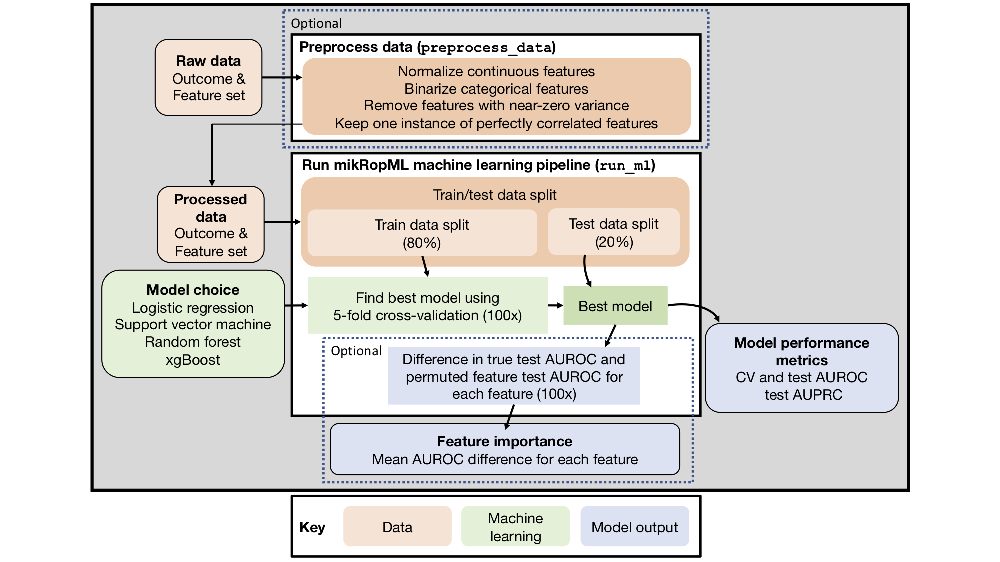

```{r setup, include = FALSE}
options(rmarkdown.html_vignette.check_title = FALSE)
knitr::opts_chunk$set(
  collapse = TRUE,
  comment = "#>"
)
```
```{r render, eval = FALSE, echo = FALSE}
rmarkdown::render(here::here('vignettes','paper.Rmd'))
```

# Summary

Machine learning (ML) for classification and prediction based on a set of 
features is used to make decisions in healthcare, economics, criminal justice 
and more. However, implementing a ML pipeline including preprocessing, 
model selection, and evaluation can be time-consuming, confusing, and difficult. 
Here, we present [`mikropml`](http://www.schlosslab.org/mikropml/) 
(prononced "meek-ROPE em el"), an easy-to-use R package that implements ML 
pipelines using regression, support vector machines, decision trees, 
random forest, or gradient-boosted trees.
The package is available on [GitHub](https://github.com/SchlossLab/mikropml/) 
and CRAN. 

# Statement of need

Most applications of machine learning (ML) require reproducible data 
pre-processing, cross-validation, testing, model evaluation, and often 
interpretation of why the model makes particular predictions. 
Performing these steps is important, as failure to implement them can result in 
incorrect and misleading results [@teschendorff_avoiding_2019; @wiens_no_2019]. 

Supervised ML is widely used to recognize patterns in large datasets 
and to make predictions about outcomes of interest. Several packages including 
`caret` [@kuhn_building_2008] and `tidymodels` [@kuhn_tidymodels_2020] in R, 
`scikitlearn` [@pedregosa_scikit-learn_2011] in Python, and the H2O `autoML` 
platform [@h2o_platform] allow scientists to train ML models with a variety of 
algorithms. While these packages provide the tools necessary for each ML step, 
they do not implement a complete ML pipeline according to good practices 
in the literature. This makes it difficult for practitioners new to ML to easily 
begin to perform ML analyses.

To enable a broader range of researchers to apply ML to their problem domains, 
we created [`mikropml`](https://github.com/SchlossLab/mikropml/), an easy-to-use 
package in R [@r_core_team_r_2020] that implements the ML pipeline created by 
Topçuoğlu _et al._ [@topcuoglu_framework_2020] in a single function that returns
the best model performance metrics and feature importance.
`mikropml` leverages the `caret` package to support several ML algorithms:
linear regression, logistic regression, 
support vector machine with a radial basis kernel, decision tree, random forest, 
and gradient boosted trees. It incorporates good practices in ML training, 
testing, and model evaluation [@topcuoglu_framework_2020;@teschendorff_avoiding_2019].
Furthermore, it provides data preprocessing steps based on the FIDDLE 
(FlexIble Data-Driven pipeLinE) framework outlined in 
Tang _et al._ [@tang_democratizing_2020] and post-training permutation 
importance steps to measure the importance of each feature in the 
models trained [@breiman_random_2001; @fisher_all_2018].

The pipeline implemented in `mikropml` is generalizable to perform ML on 
datasets from many different fields. It has already been applied to microbiome 
data to categorize patients with colorectal cancer [@topcuoglu_framework_2020], 
to identify differences in genomic and clinical features associated with 
bacterial infections [@lapp_machine_2020], 
and to predict gender-based biases in academic publishing [@hagan_women_2020]. 

# mikropml package

The `mikropml` package includes functionality to preprocess the data, train ML 
models, and quantify feature importance (Figure 1). We also provide 
[vignettes](http://www.schlosslab.org/mikropml/articles/index.html) and an 
[example snakemake workflow](https://github.com/SchlossLab/mikropml-snakemake-workflow) [@koster_snakemakescalable_2012] 
to showcase how to run an ideal ML pipeline with multiple different train/test 
data splits. The results can be visualized using helper functions that use 
`ggplot2` [@wickham_ggplot2_2016].

## Preprocessing data

We provide a function `preprocess_data()` to preprocess features using several 
different functions from the `caret` package. The `preprocess_data()` function 
takes continuous and categorical data, re-factors categorical data into binary 
features, and provides options to normalize continuous data, remove features 
with near-zero variance, and keep only one instance of perfectly correlated 
features. We set the default options based on best practices implemented in 
FIDDLE [@tang_democratizing_2020]. More details on how to use 
`preprocess_data()` can be found in the accompanying [vignette](http://www.schlosslab.org/mikropml/articles/preprocess.html).

## Running ML

The main function in mikropml, `run_ml()`, minimally takes in the model choice 
and a data frame with an outcome column and remaining columns as categorical 
or continuous features. For model choice, `mikropml` currently supports logistic 
and linear regression [`glm`: @friedman_regularization_2010], support vector 
machines with a radial basis kernel [`kernlab`: @karatzoglou_kernlab_2004], 
decision trees [`rpart`: @therneau_rpart_2019], 
random forest [`randomForest`: @liaw_classication_2002], 
and gradient-boosted trees [`xgboost`:  @chen_xgboost_2020]. 
`run_ml()` randomly splits the data into train and test sets while maintaining 
the distribution of the outcomes found in the full dataset. 
It also provides the option to split the data into train and test sets based on 
categorical variables (e.g. batch, geographic location, etc.).
`mikropml` uses the `caret` package [@kuhn_building_2008] to train and evaluate 
the models, and optionally quantifies feature importance.
The output includes the best model built based on tuning hyperparameters in an 
internal and repeated cross-validation step, model evaluation metrics, and 
optional feature importances. 
Feature importances are calculated using a permutation test, which breaks the 
relationship between the feature and the true outcome in the test data, 
and measures the change in model performance. This provides an intuitive metric 
of how individual features influence model performance and is comparable across 
model types, which is particularly useful for model 
interpretation [@topcuoglu_framework_2020]. Our 
[introductory vignette](http://www.schlosslab.org/mikropml/articles/introduction.html) 
contains a comprehensive tutorial on how to use `run_ml()`.

{width=100%}

## Ideal workflow for running mikropml with many different train/test splits

To investigate the variation in model performance depending on the train and 
test set used [@topcuoglu_framework_2020; @lapp_machine_2020], 
we provide examples of how to run the `run_ml()` function many times with 
different train/test splits and how to get summary information about model 
performance on 
[a local computer](http://www.schlosslab.org/mikropml/articles/parallel.html) 
or on a high-performance computing cluster using a 
[snakemake workflow](https://github.com/SchlossLab/mikropml-snakemake-workflow). 

## Tuning & visualization

One particularly important aspect of ML is hyperparameter tuning. 
Practitioners must explore a range of hyperparameter possibilities.
Therefore, we provide a function `plot_hp_performance()` to plot the 
cross-validation performance metric of models built using different train/test 
splits. This helps evaluate if the hyperparameter range is being searched 
exhaustively and allows the user to pick the ideal set. We also provide summary 
plots of test performance metrics for the many train/test splits with different 
models using `plot_model_performance()`. Examples are described in the 
accompanying [vignette on hyperparameter tuning](http://www.schlosslab.org/mikropml/articles/tuning.html).

## Dependencies

mikropml is written in R [@r_core_team_r_2020] and depends on several packages:
`dplyr` [@wickham_dplyr_2020], `rlang` [@henry_rlang_2020] 
and `caret` [@kuhn_building_2008].
The ML algorithms supported by `mikropml` require:
`glmnet` [@friedman_regularization_2010], `e1071` [@meyer_e1071_2020], 
and `MLmetrics` [@yan_mlmetrics_2016] for logistic regression, 
`rpart2` [@therneau_rpart_2019] for decision trees, 
`randomForest` [@liaw_classication_2002] for random forest, 
`xgboost` [@chen_xgboost_2020] for xgboost, and 
`kernlab` [@karatzoglou_kernlab_2004] for support vector machines. 
We also allow for parallelization of cross-validation and other steps using 
the `foreach`, `doFuture`, `future.apply`, 
and `future` packages [@bengtsson_futureapply_2020].
Finally, we use `ggplot2` for plotting [@wickham_ggplot2_2016].

# Acknowledgments

We thank members of the Schloss Lab who participated in code clubs related to 
the initial development of the pipeline.

# Funding

Salary support for PDS came from NIH grant 1R01CA215574.
KLS received support from the NIH Training Program in Bioinformatics (T32 GM070449).
ZL received support from the National Science Foundation Graduate Research Fellowship Program under Grant No. DGE 1256260. 
Any opinions, findings, and conclusions or recommendations expressed in this material are those of the authors and do not necessarily reflect the views of the National Science Foundation.

# Author contributions

BT, ZL, and KLS conceptualized the study and created the package.
BT, ZL, JW, and PDS developed methodology. 
PDS, ES, and JW supervised the project. 
BT, ZL, and KLS wrote the original draft. 
All authors reviewed and edited the manuscript.

# Conflicts of interest

None.

# References
